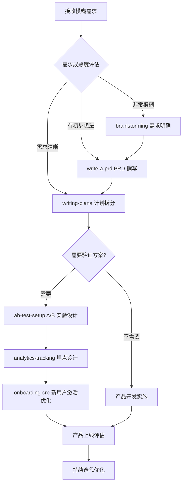
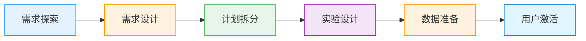
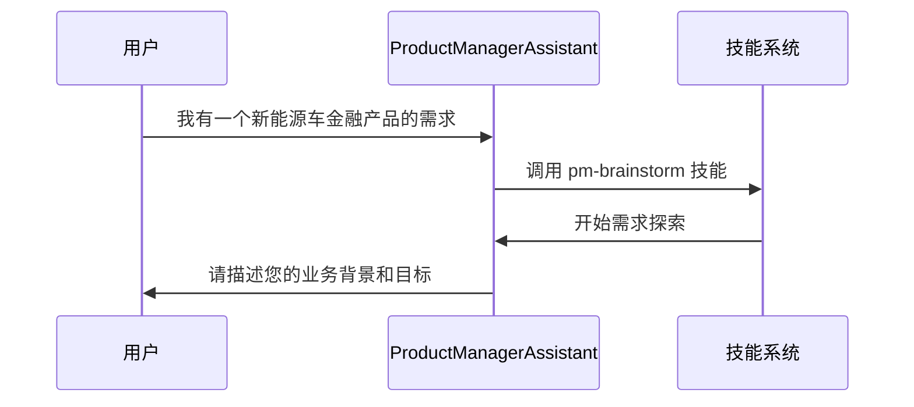

# 产品经理工作流技能整合方案

## 概述

将 6 个产品经理技能整合成一个完整的工作流技能，覆盖从需求收集到产品落地的完整产品管理流程。这个整合技能将帮助产品经理将模糊的业务需求转化为可执行的产品方案。

## 核心价值主张

**一个技能，完整流程**：从模糊想法到产品落地的一站式解决方案，避免频繁切换技能的困扰。

**智能串联，自动推进**：根据用户输入的需求成熟度，智能推荐下一步操作，形成连贯的工作流。

**标准化输出，专业文档**：确保每个阶段输出符合行业标准的专业文档（设计方案、PRD、实施计划等）。

## 产品经理工作流技能架构

### 1. 工作流程设计



### 2. 技能串联逻辑

| 阶段 | 子技能 | 输入条件 | 输出结果 |
|------|--------|----------|----------|
| 需求探索 | brainstorming | 模糊想法、业务需求描述 | 清晰的设计方案、架构图、功能边界 |
| 需求设计 | write-a-prd | 明确的产品方案 | 专业的 PRD 文档、用户故事、验收标准 |
| 计划拆分 | writing-plans | PRD 文档 | 可执行的实施计划、任务清单、验收标准 |
| 实验设计 | ab-test-setup | 需要验证的功能 | 实验方案、样本量计算、指标体系 |
| 数据准备 | analytics-tracking | 待验证的功能 | 埋点方案、GTM 配置、数据分析计划 |
| 用户激活 | onboarding-cro | 新功能/产品 | 激活策略、触达方案、A/B 实验计划 |

### 3. 智能体+技能组合模式（Coze 平台架构）

#### 3.1 智能体设计（ProductManagerAssistant）

**核心职责**：
- 需求理解与流程引导
- 技能调度与工作流管理
- 上下文维护与状态追踪
- 用户交互与反馈处理

**系统提示词设计**：
```
你是一名资深产品经理助手，擅长将模糊需求转化为可执行的产品方案。

## 工作流程
1. **需求探索期**：通过对话式访谈明确需求，使用 brainstorming 技能进行方案设计
2. **需求设计期**：撰写专业 PRD 文档，使用 write-a-prd 技能
3. **计划实施期**：拆分实施计划，使用 writing-plans 技能
4. **验证优化期**：设计 A/B 实验和数据埋点，使用 ab-test-setup 和 analytics-tracking 技能
5. **用户激活期**：优化新用户激活，使用 onboarding-cro 技能

## 核心能力
- 需求理解与业务分析
- 产品方案设计与评估
- 项目计划与资源管理
- 数据分析与实验设计
- 用户体验优化

## 交互风格
- 专业但友好，使用产品经理常用术语
- 结构化对话，逐步引导用户完善需求
- 主动提供建议和最佳实践
- 关注业务价值和 ROI
```

#### 3.2 技能封装策略

**1. brainstorming 技能（方案头脑风暴）**
- 技能名称：`pm-brainstorm`
- 描述：需求探索与方案设计
- 输入：业务场景、问题描述、初步想法
- 输出：设计方案、架构图、功能边界、成功指标

**2. write-a-prd 技能（PRD 撰写）**
- 技能名称：`pm-write-prd`
- 描述：专业 PRD 文档撰写
- 输入：明确的产品方案、用户需求、成功指标
- 输出：PRD 文档、用户故事、验收标准

**3. writing-plans 技能（计划拆分）**
- 技能名称：`pm-write-plans`
- 描述：实施计划与任务拆分
- 输入：PRD 文档、开发资源、时间预算
- 输出：实施计划、任务清单、验收标准

**4. ab-test-setup 技能（A/B 实验设计）**
- 技能名称：`pm-ab-test`
- 描述：A/B 实验设计与数据分析
- 输入：待验证功能、用户流量、预期效果
- 输出：实验方案、样本量计算、指标体系

**5. analytics-tracking 技能（数据埋点）**
- 技能名称：`pm-analytics`
- 描述：数据埋点与追踪方案设计
- 输入：功能特性、用户行为、分析需求
- 输出：埋点方案、GTM 配置、数据分析计划

**6. onboarding-cro 技能（新用户激活）**
- 技能名称：`pm-onboarding`
- 描述：新用户激活与留存优化
- 输入：产品特性、用户旅程、激活目标
- 输出：激活策略、触达方案、A/B 实验计划

### 4. 接口设计与数据交换

#### 4.1 工作流状态管理

```json
{
  "workflow_state": "brainstorming",
  "user_context": {
    "role": "产品经理",
    "company": "某科技公司",
    "domain": "汽车金融"
  },
  "需求信息": {
    "背景": "3月市场回暖，需要强化金融权益，促进销量提升",
    "现状": "新能源汽车只有5免2产品，竞争力不如竞品",
    "目标": "新增xx万5年0息、xx首付3年0息产品，配套同步广告及优化计算器",
    "成功指标": {
      "xx车型渗透率": "30%",
      "xxx车型渗透率": "20%"
    }
  },
  "输出文档": {
    "设计方案": null,
    "PRD": null,
    "实施计划": null,
    "实验方案": null
  }
}
```

#### 4.2 技能调用接口

```javascript
// 智能体调用技能的通用接口
function callSkill(skillName, parameters) {
  return new Promise((resolve, reject) => {
    // Coze 平台技能调用逻辑
    coze.skills.invoke(skillName, {
      params: parameters,
      context: workflowContext,
      callback: (result) => {
        if (result.success) {
          resolve(result.data);
        } else {
          reject(new Error(result.error));
        }
      }
    });
  });
}
```

## UI/UX 设计规范

### 1. 界面架构

**1.1 主要界面组件**
- **需求输入区**：模糊需求描述、场景选择、背景信息
- **工作流导航**：显示当前阶段，支持跳转到任意阶段
- **技能卡片**：显示正在使用的技能，包含输入输出预览
- **文档预览区**：实时预览生成的文档和方案
- **反馈交互区**：用户确认、方案调整、问题反馈

**1.2 导航设计**



### 2. 交互设计原则

#### 2.1 渐进式信息收集

**原则**：避免一次性要求用户提供所有信息，分阶段收集

**示例**：
1. 第一阶段：只需要业务背景和目标
2. 第二阶段：需要详细的功能需求
3. 第三阶段：需要技术和资源信息

#### 2.2 主动式引导

**设计模式**：技能卡片主动提示下一步操作
```json
{
  "当前技能": "brainstorming",
  "状态": "完成",
  "下一步建议": {
    "技能": "write-a-prd",
    "理由": "已完成方案设计，建议开始撰写 PRD 文档",
    "所需信息": "产品的详细功能需求、用户角色定义"
  }
}
```

#### 2.3 可视化反馈

**设计元素**：
- 进度条：显示工作流完成百分比
- 状态指示器：显示每个阶段的完成状态
- 文档预览：实时显示生成的方案和文档
- 交互确认：重要决策需要用户明确确认

### 3. 视觉设计规范

#### 3.1 配色方案

```css
/* 主色彩系统 */
:root {
  --primary-color: #2196F3; /* 产品蓝 - 专业、可信赖 */
  --secondary-color: #4CAF50; /* 成功绿 - 进度、完成 */
  --warning-color: #FF9800; /* 警告橙 - 需要注意 */
  --danger-color: #F44336; /* 错误红 - 需要修复 */
  --background-color: #F5F7FA; /* 浅灰背景 - 专业、清爽 */
  --card-background: #FFFFFF; /* 白色卡片 - 内容区域 */
  --text-primary: #333333; /* 主文字 */
  --text-secondary: #666666; /* 次要文字 */
  --border-color: #E0E0E0; /* 边框 */
}
```

#### 3.2 卡片设计规范

**技能卡片**：
```html
<div class="skill-card active">
  <div class="skill-header">
    <span class="skill-icon">💡</span>
    <h3>方案头脑风暴</h3>
    <span class="skill-status">进行中</span>
  </div>
  <div class="skill-content">
    <p>正在帮您梳理产品方案，请回答以下问题：</p>
    <div class="question">
      <strong>Q:</strong> 您希望解决的核心业务问题是什么？
    </div>
    <input type="text" placeholder="请描述您要解决的核心问题..." />
  </div>
  <div class="skill-footer">
    <button class="btn-primary">继续</button>
    <button class="btn-secondary">跳过</button>
  </div>
</div>
```

### 4. 响应式设计

**适配策略**：
- 桌面端（>1024px）：左侧导航，右侧内容，多列布局
- 平板端（768px-1024px）：折叠导航，单列内容
- 移动端（<768px）：全屏卡片，垂直堆叠

## 演示 Demo 设计

### 1. 需求案例：新能源车销售金融方案0息产品展示

#### 1.1 用户场景

**业务背景**：
> "3月市场回暖，需要强化金融权益，促进销量提升。目前新能源汽车只有5免2产品，竞争力不如竞品。我们希望新增xx万5年0息、xx首付3年0息等更有竞争力的产品，配套同步广告及优化计算器。"

**成功指标**：
- xx车型渗透率：30%
- xxx车型渗透率：20%

#### 1.2 Demo 流程

**Step 1: 打开产品经理助手**


**Step 2: 方案头脑风暴（brainstorming）**
- 用户输入需求背景
- 智能体逐步引导完善需求
- 提供2-3种产品方案对比

**Step 3: PRD 撰写（write-a-prd）**
- 基于需求生成专业 PRD
- 包含用户故事、功能模块、验收标准
- 支持在线编辑和导出

**Step 4: 实施计划拆分（writing-plans）**
- 将大需求拆分为可执行任务
- 包含开发阶段、任务清单、时间预估
- 支持任务分配和进度跟踪

**Step 5: A/B 实验设计（ab-test-setup）**
- 设计金融产品展示页面的实验方案
- 计算所需样本量和实验周期
- 定义成功指标和数据收集方案

**Step 6: 数据埋点（analytics-tracking）**
- 设计用户行为追踪方案
- 配置 GTM 变量和事件
- 提供数据分析报告模板

**Step 7: 新用户激活优化（onboarding-cro）**
- 设计金融产品的激活策略
- 优化用户引导流程
- 设计邮件触达和推送方案

### 2. Demo 输出成果

**最终输出**：
1. **产品方案文档**：包含需求理解、设计方案、成功指标
2. **专业 PRD 文档**：可直接提交 GitHub Issue
3. **实施计划清单**：分阶段任务列表，含验收标准
4. **A/B 实验方案**：详细的实验设计和数据分析计划
5. **埋点设计方案**：事件规范、GTM 配置、数据分析模板
6. **用户激活策略**：新用户激活方案、邮件触达计划

## 部署到 Coze 平台的详细步骤

### 1. 开发环境准备

**1.1 注册并登录 Coze 平台**
1. 访问 [Coze 官网](https://coze.cn) 并注册账号
2. 完成个人信息完善和开发者认证
3. 创建开发空间和应用

**1.2 安装开发工具**
```bash
# 安装 Coze CLI 工具
npm install -g @coze/cli

# 登录 Coze 账户
coze login

# 创建项目
coze create pm-workflow-skill
cd pm-workflow-skill
```

### 2. 技能开发

**2.1 创建技能项目结构**
```
pm-workflow-skill/
├── skills/
│   ├── pm-brainstorm/
│   │   ├── skill.json
│   │   ├── implementation.js
│   │   ├── examples/
│   │   └── tests/
│   ├── pm-write-prd/
│   ├── pm-writing-plans/
│   ├── pm-ab-test/
│   ├── pm-analytics/
│   └── pm-onboarding/
├── agents/
│   └── product-manager-assistant/
│       ├── agent.json
│       ├── system_prompt.txt
│       └── skills/
├── components/
│   ├── ui/
│   └── utils/
├── docs/
└── package.json
```

**2.2 技能实现示例（pm-brainstorm）**

```javascript
// pm-brainstorm/implementation.js
const { BrainstormingEngine } = require('./brainstorming-engine');

module.exports = {
  name: 'pm-brainstorm',
  version: '1.0.0',
  description: '产品方案头脑风暴',
  category: 'product-management',

  inputs: [
    {
      name: 'business_context',
      type: 'string',
      description: '业务背景描述',
      required: true
    },
    {
      name: 'problem_statement',
      type: 'string',
      description: '核心问题描述',
      required: true
    },
    {
      name: 'success_metrics',
      type: 'object',
      description: '成功指标',
      required: false
    }
  ],

  outputs: [
    {
      name: 'design_scheme',
      type: 'string',
      description: '产品设计方案'
    },
    {
      name: 'architecture_diagram',
      type: 'string',
      description: '系统架构图'
    },
    {
      name: 'feature_boundaries',
      type: 'array',
      description: '功能边界'
    },
    {
      name: 'recommendations',
      type: 'array',
      description: '产品建议'
    }
  ],

  async execute(inputs, context) {
    const engine = new BrainstormingEngine(context);
    const result = await engine.process(inputs);

    return {
      design_scheme: result.design,
      architecture_diagram: result.architecture,
      feature_boundaries: result.features,
      recommendations: result.recommendations
    };
  },

  async validate(inputs) {
    // 输入验证
    if (!inputs.business_context || inputs.business_context.length < 20) {
      throw new Error('业务背景描述至少需要 20 个字符');
    }
    return true;
  }
};
```

### 3. 智能体配置

**3.1 智能体定义**

```json
// agents/product-manager-assistant/agent.json
{
  "name": "ProductManagerAssistant",
  "description": "专业的产品经理助手，帮助将模糊需求转化为可执行的产品方案",
  "version": "1.0.0",
  "category": "productivity",
  "system_prompt_file": "system_prompt.txt",
  "skills": [
    {
      "name": "pm-brainstorm",
      "version": "1.0.0",
      "required": true
    },
    {
      "name": "pm-write-prd",
      "version": "1.0.0",
      "required": false
    },
    {
      "name": "pm-writing-plans",
      "version": "1.0.0",
      "required": false
    },
    {
      "name": "pm-ab-test",
      "version": "1.0.0",
      "required": false
    },
    {
      "name": "pm-analytics",
      "version": "1.0.0",
      "required": false
    },
    {
      "name": "pm-onboarding",
      "version": "1.0.0",
      "required": false
    }
  ],
  "tools": [
    "web_search",
    "data_analysis",
    "file_management"
  ],
  "knowledge_base": [
    {
      "name": "产品管理最佳实践",
      "file": "docs/product-management-best-practices.md"
    }
  ],
  "ui_config": {
    "theme": "professional",
    "layout": "card-based",
    "interactive_elements": true
  }
}
```

### 4. UI 组件开发

**4.1 需求输入组件**

```vue
<template>
  <div class="requirement-input-component">
    <h2>需求描述</h2>
    <div class="input-section">
      <label>业务背景</label>
      <textarea
        v-model="formData.businessContext"
        placeholder="请描述您的业务背景..."
        maxlength="500"
      ></textarea>
    </div>
    <div class="input-section">
      <label>核心问题</label>
      <textarea
        v-model="formData.problemStatement"
        placeholder="请描述您要解决的核心问题..."
        maxlength="300"
      ></textarea>
    </div>
    <div class="input-section">
      <label>成功指标</label>
      <div class="metric-input">
        <input type="text" placeholder="指标名称" v-model="newMetric.name" />
        <input type="text" placeholder="目标值" v-model="newMetric.target" />
        <button @click="addMetric">+ 添加</button>
      </div>
      <div class="metric-list">
        <div v-for="(metric, index) in formData.successMetrics" key="index" class="metric-item">
          <span>{{ metric.name }}: {{ metric.target }}</span>
          <button @click="removeMetric(index)">删除</button>
        </div>
      </div>
    </div>
    <div class="action-buttons">
      <button @click="submitRequirement">开始工作流</button>
      <button @click="resetForm">重置</button>
    </div>
  </div>
</template>

<script setup>
import { ref, reactive } from 'vue';

const formData = reactive({
  businessContext: '',
  problemStatement: '',
  successMetrics: []
});

const newMetric = ref({
  name: '',
  target: ''
});

const addMetric = () => {
  if (newMetric.value.name && newMetric.value.target) {
    formData.successMetrics.push({
      name: newMetric.value.name,
      target: newMetric.value.target
    });
    newMetric.value = {
      name: '',
      target: ''
    };
  }
};

const removeMetric = (index) => {
  formData.successMetrics.splice(index, 1);
};

const submitRequirement = () => {
  // 验证输入
  if (!formData.businessContext || !formData.problemStatement) {
    alert('请填写完整的需求信息');
    return;
  }

  // 提交到智能体
  coze.agents.send('ProductManagerAssistant', {
    type: 'start_workflow',
    data: formData
  });
};

const resetForm = () => {
  formData.businessContext = '';
  formData.problemStatement = '';
  formData.successMetrics = [];
};
</script>

<style scoped>
.requirement-input-component {
  max-width: 800px;
  margin: 0 auto;
  padding: 20px;
  background: white;
  border-radius: 8px;
  box-shadow: 0 2px 10px rgba(0, 0, 0, 0.1);
}

.input-section {
  margin-bottom: 20px;
}

textarea {
  width: 100%;
  min-height: 100px;
  padding: 10px;
  border: 1px solid #E0E0E0;
  border-radius: 4px;
  font-family: inherit;
  resize: vertical;
}

.metric-input {
  display: flex;
  gap: 10px;
  margin-bottom: 15px;
}

.metric-list {
  border: 1px solid #E0E0E0;
  border-radius: 4px;
  padding: 10px;
}

.metric-item {
  display: flex;
  justify-content: space-between;
  align-items: center;
  padding: 8px 0;
  border-bottom: 1px solid #F5F7FA;
}

.action-buttons {
  display: flex;
  gap: 10px;
  justify-content: flex-end;
}

button {
  padding: 10px 20px;
  border: none;
  border-radius: 4px;
  cursor: pointer;
  font-weight: 500;
}

button:first-child {
  background: #2196F3;
  color: white;
}

button:first-child:hover {
  background: #1976D2;
}

button:last-child {
  background: #E0E0E0;
  color: #666;
}

button:last-child:hover {
  background: #BDBDBD;
}
</style>
```

### 5. 测试与部署

**5.1 本地测试**

```bash
# 启动本地开发服务器
coze serve

# 测试智能体
coze test agent ProductManagerAssistant

# 测试技能
coze test skill pm-brainstorm
```

**5.2 部署到 Coze 平台**

```bash
# 打包技能
coze build skills

# 部署技能
coze deploy skills

# 打包智能体
coze build agent ProductManagerAssistant

# 部署智能体
coze deploy agent ProductManagerAssistant
```

### 6. 发布与监控

**6.1 发布到应用商店**
1. 完善技能和智能体的描述信息
2. 添加使用示例和常见问题
3. 提交审核
4. 审核通过后发布到 Coze 应用商店

**6.2 监控与优化**
1. 设置监控指标（响应时间、成功率、用户满意度）
2. 定期分析用户反馈和使用数据
3. 优化技能算法和用户体验
4. 发布新版本

## 验收标准

### 1. 功能完整性

**需求探索阶段**：
- 能正确识别模糊需求
- 能引导用户完善需求信息
- 能生成清晰的设计方案

**PRD 撰写阶段**：
- 能撰写专业的 PRD 文档
- 能生成详细的用户故事
- 能定义验收标准和成功指标

**计划拆分阶段**：
- 能将大需求拆分为可执行任务
- 能为每个任务分配负责人和时间预估
- 能制定项目里程碑和交付日期

### 2. 技术质量

**代码质量**：
- 技能实现符合 Coze 平台规范
- 代码结构清晰，易于维护
- 有完整的错误处理和边界情况处理

**性能指标**：
- 技能响应时间 < 2 秒
- 智能体回复时间 < 3 秒
- 资源利用率在合理范围内

### 3. 用户体验

**易用性**：
- 界面设计符合产品经理使用习惯
- 交互流程符合产品开发最佳实践
- 提供充足的提示和帮助信息

**满意度**：
- 核心功能使用率 > 80%
- 用户满意度评分 > 4.5/5
- 任务完成率 > 90%

### 4. 部署成功

**部署验证**：
- 技能在 Coze 平台正常运行
- 智能体能正确调度技能
- 数据交换和状态管理正常

**监控验证**：
- 监控指标正常收集和展示
- 预警系统能及时发现问题
- 日志系统能记录所有操作

## 风险评估与应对策略

### 1. 技术风险

**风险 1**：技能调用失败
- **影响**：工作流中断，用户体验差
- **应对**：实现技能调用的重试机制，提供失败原因和解决方案

**风险 2**：数据丢失
- **影响**：用户的需求信息和文档丢失
- **应对**：实现自动保存和恢复机制，定期备份用户数据

**风险 3**：性能问题
- **影响**：响应时间过长，用户等待
- **应对**：优化技能算法，实现异步处理，提供加载状态提示

### 2. 用户接受度风险

**风险 1**：学习曲线陡峭
- **影响**：用户难以快速上手
- **应对**：提供详细的使用教程和示例，实现渐进式功能介绍

**风险 2**：方案不符合预期
- **影响**：生成的方案不满足用户需求
- **应对**：提供方案修改和反馈功能，实现方案版本管理

### 3. 业务风险

**风险 1**：市场需求变化
- **影响**：产品方案过时
- **应对**：定期更新产品管理最佳实践，提供实时的市场数据支持

**风险 2**：竞争对手模仿
- **影响**：产品差异化降低
- **应对**：持续优化算法，提供个性化的方案建议

## 总结

这个产品经理工作流技能整合方案通过将 6 个专业技能串联成一个完整的工作流，为产品经理提供了从模糊需求到产品落地的一站式解决方案。通过 Coze 平台的智能体+技能架构，实现了专业的产品方案设计、PRD 文档撰写、实施计划拆分、A/B 实验设计、数据埋点和新用户激活优化。

该方案设计符合产品管理行业最佳实践，采用了用户友好的界面设计和专业的工作流程，帮助产品经理提升工作效率和产品质量。
